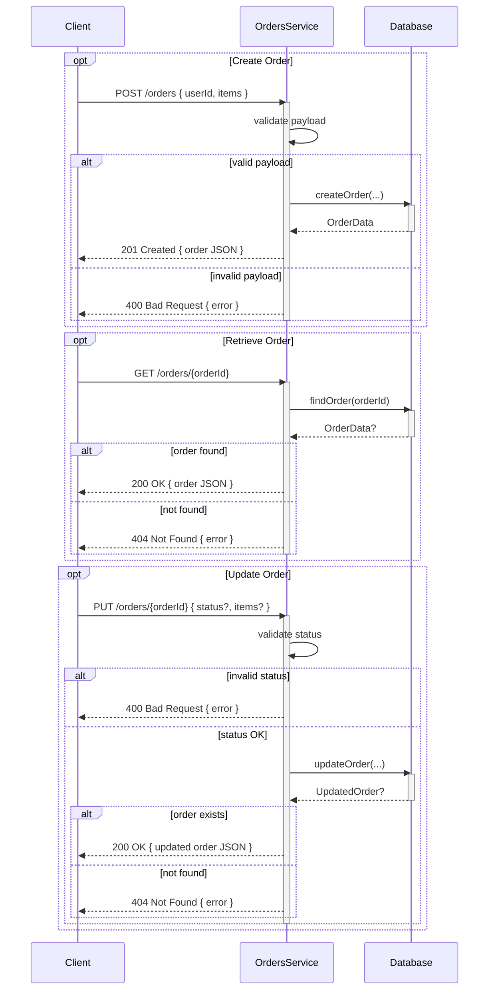

# Orders Microservice and Test Suite

## Overview

This repository contains a simple Orders microservice built with Node.js and Express, along with a test script to verify its functionality. The service allows clients to create, retrieve, and update orders, which consist of an orderId, userId, status (either open or complete), and a JSON array of order items.

## Prerequisites

- Node.js (v14+)

- npm

## Installation

### Clone the repository:

git clone https://github.com/cohenvelazquez/CS361_microTyler.git

cd CS361_microTyler/

### Install dependencies:

npm install

## Usage

### Running the Service

Start the orders microservice on the default port (3000):

node checkout.js

You should see:

Orders microservice listening on http://localhost:3000

## API Endpoints

### Create a New Order

- URL: POST /orders

- Body:

```json
{
  "userId": "string",
  "items": [
    { "productId": "string", "quantity": number, "price": number },
    ...
  ]
}
```
- Response: 201 Created

```json
{
  "orderId": "uuid",
  "userId": "string",
  "status": "open",
  "items": [ ... ]
}
```

### Retrieve an Order

- URL: GET /orders/:orderId

- Response: 200 OK

```json
{
  "orderId": "uuid",
  "userId": "string",
  "status": "open" | "complete",
  "items": [ ... ]
}
```

- Error: 404 Not Found if order does not exist.

### Update an Order

- URL: PUT /orders/:orderId

- Body (any combination):

```json
{
  "status": "open" | "complete",
  "items": [ ... ]
}
```

- Response: 200 OK with the updated order object.

- Error: 400 Bad Request for invalid status, 404 Not Found if order not found.

### Testing

A simple test script (testOrders.js) uses axios to validate each endpoint in sequence.

### Setup

Install axios:

npm install axios

### Run Tests

With the server running, execute:

node testOrders.js

This will:

1. POST /orders – create a new order and log its orderId.

1. GET /orders/:orderId – retrieve and display the order.

1. PUT /orders/:orderId – update the status to complete.

1. PUT /orders/:orderId – modify the items array.

1. GET /orders/:orderId – final sanity-check.

If any request fails, the script will log an error and exit with code 1.

## UML Diagram

